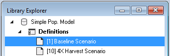
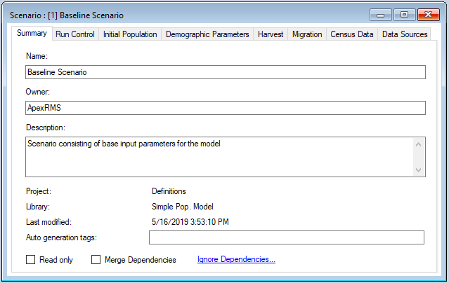

# Getting started with **DG-Sim**

## Quickstart Tutorial

This quickstart tutorial will introduce you to basics of working with DG-Sim. The steps we will lead you through include:
 
* Installing a Packages
* Creating a new library
* Viewing and editing model Datafeeds
* Running a Model
* Analyzing the Results

## **Step 1: Install DG-Sim**
**DG-Sim** is a module within the [SyncroSim](https://syncrosim.com/) simulation modeling framework; as such, running **DG-Sim** requires that the **SyncroSim** software be installed on your computer.
1. To install **DG-Sim**, follow the instructions under [How to Install](https://apexrms.github.io/dgsim/)
2. Once installed, open the **SyncroSim** Windows application.

## **Step 2: Create a new DG-Sim library**
Having installed the **DG-Sim** package, you are now ready to create your first SyncroSim Library. A Library is a file (with extension *.ssim*) that contains all of your model inputs and outputs. Note that the format of each Library is specific to the Package for which it was initially created. To create a new Library, choose **New Library...** from the **File** menu.
 

 
In this window:
 
* Select the row for the **dgsim - Simulates demographics of wildlife populations**. Note that as you select a row, the list of **Templates** available and suggested file **Name** for that base package are updated.
* Select the **Simple Pop. Model** Template as shown above.
* Optionally type in a new **Name** for the Library (or accept the default); you can also change the **Location** of the file using the **Browse...** button.
 
When you are ready to create the Library file, click **OK**. A new Library will be created and loaded into the Library Explorer.

## **Step 3: Review the model inputs**
The contents of your newly created Library are now displayed in the Library Explorer. Model inputs in SyncroSim are organized into Scenarios, where each Scenario consists of a suite of values, one for each of the Model's required inputs.

**Note:** Because you chose the **Simple Pop. Model** Template when you created your Library, your Library already contains two pre-configured Scenarios with model inputs. These inputs were filled in and distributed as a sample with the package to help you get started quickly, and represent hypothetical management Scenarios: one a Baseline, and another at 4x Harvest.
 

 
As shown in the image above, the Library you have just opened contains two Scenarios, each with a unique ID. The first of these scenarios (with ID=1, as shown above in square brackets) is named **Baseline Scenario**; this scenario contains a suite of model inputs corresponding to a hypothetical baseline harvest plan. The second scenario (with ID=10 and named **4x Harvest Scenario**) contains model inputs corresponding to an alternative plan where harvest targets are 4 times greater than those of the Baseline Scenario.
 
To view the details of the first of these Scenarios:
 
* Select the scenario named **Baseline Scenario** in the Library Explorer.
* Right-click and choose **Properties** from the context menu to view the details of the Scenario.
 
This opens the Scenario Properties window.
 

 
The first tab in this window, called **Summary**, displays some generic information for the Scenario. The second tab, **Run Control**, contains parameters for running a model simulations. In this example, the Scenario will run for 20 years, starting in the year 2018 on Julian day 152 (June 1st), and repeated for 100 Monte Carlo iterations. The Start Julian day represents the date at which the simulation begins each year, as well as the parturition (i.e. birth) date for females, and the date at which model output is reported.
 

 
