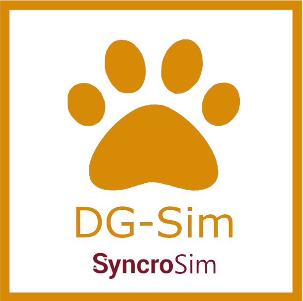

# **DG-Sim** SyncroSim Package

    <a href="https://github.com/ApexRMS/dgsim">
 
## Simulate demographics of wildlife populations
### *DG-Sim* is an open-source [SyncroSim](https://syncrosim.com/){:target="_blank"} Base Package for forecasting wildlife population size and harvest.

The **DG-Sim** package consists of a general population-modeling framework which uses a stochastic, stage-structured matrix approach to project wildlife abundance over time. Built upon the [SyncroSim](https://syncrosim.com/){:target="_blank"} software platform, **DG-Sim** is a wildlife harvest management tool capable of exploring the effects of alternative future harvest quotas and scenarios. Users of **DG-Sim** can choose to incorporate model inputs for their population of interest including, but not limited to: birth rate estimates, natural mortality rates, target harvest levels, and initial sub‐population size. The stochastic nature of **DG‐Sim** allows model projections to incorporate uncertainty in model inputs.

**DG-Sim** has been continuously developed with a user-friendly interface in mind. As such, users of the package are given the flexibility and control to interactively undertake “what‐if” analyses of model projections. **DG-Sim**'s accessible framework has helped support natural resource governance projects such as a community-led harvest calculator for muskoxen in Greenland, allowing for collaborative harvest management planning between community, industry, and government [(Cuyler, Daniel, Enghoff et al., 2020)](https://doi.org/10.1111/csp2.159){:target="_blank"}. **DG-Sim** currently offers multi-language support in English, Greenlandic, and Danish.

## Requirements

This package requires the [latest version](https://syncrosim.com/download/){:target="_blank"} of SyncroSim.
 
 
## How to Install

Open SyncroSim and select **File -> Packages… -> Install…**, then select the **DG-Sim** package and click OK.

Alternatively, download the [latest release](https://github.com/ApexRMS/dgsim/releases/){:target="_blank"} from GitHub. Open SyncroSim and select File -> Packages… -> Install From File…, then navigate to the downloaded package file with the extension *.ssimpkg*.
 
 
## Getting Started

For more information on **DG-Sim**, including a Quickstart Tutorial, see the [Getting Started](https://apexrms.github.io/dgsim/getting_started.html){:target="_blank"} page.
 
 
## Links

Browse source code at
[http://github.com/ApexRMS/dgsim/](http://github.com/ApexRMS/dgsim/){:target="_blank"}
 
Report a bug at
[http://github.com/ApexRMS/dgsim/issues](http://github.com/ApexRMS/dgsim/issues){:target="_blank"}
 
 
## Developers

Leonardo Frid (Author, maintainer) 
 
Colin Daniel (Author)
 
Alex Embrey (Author)
